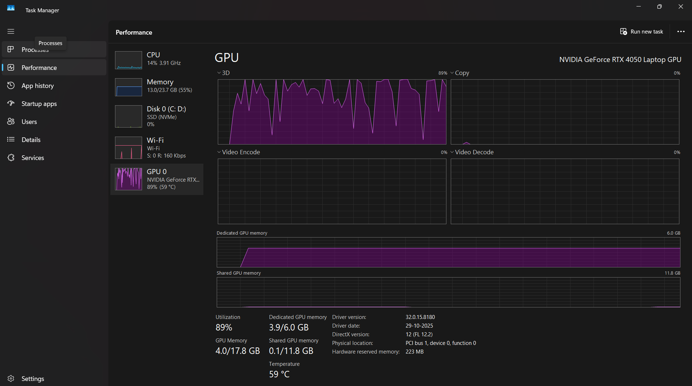

🚀 Cuda-Content-Architect: Fully Local Edge AI System

Cuda-Content-Architect is a high-performance, privacy-first AI multi-agent system designed to transform long-form video intelligence into viral social media assets. Engineered to run 100% locally, it utilizes NVIDIA hardware acceleration to bypass cloud API costs, rate limits, and data privacy concerns.

🏗️ System Architecture
The system employs an autonomous multi-agent sequential workflow orchestrated via CrewAI:
Lead Video Researcher: * Logic: Executes deep data extraction from YouTube URLs.
Engineering: Features a custom Data Truncation Engine to manage token density and prevent VRAM overflow.
Capability: Handles multi-language transcripts (English/Hindi) with automatic translation logic.
Social Media Architect: * Logic: Performs creative synthesis on raw research data.
Output: Generates 5 high-impact LinkedIn posts and 2 viral Twitter threads using a "Helpful Peer" brand voice.

🛠️ The Tech Stack
Orchestration: CrewAI (Agentic Workflow Framework)
Local LLM Server: Ollama (Running Llama 3.2 3B)
Compute Layer: NVIDIA CUDA (Hardware-accelerated inference)
Data Scraper: Custom object-oriented youtube-transcript-api implementation.

🔥 Hardware-Acceleration & Performance
This project is optimized to maximize local silicon. During the synthesis phase on an NVIDIA RTX 4050 (6GB VRAM), the system achieves:
89% GPU Utilization: Directly offloading cognitive tasks to CUDA cores.
VRAM Efficiency: Optimized to run entirely within 3.9GB of Dedicated VRAM, ensuring zero reliance on slower system shared memory.
Zero-Cost Inference: No OpenAI/Gemini API keys required.

🛡️ Custom Engineering Guardrails
To ensure production-grade reliability on consumer hardware, we implemented:
Anti-Hallucination Logic: Strict instructions to stop the LLM from fabricating data if a transcript is unavailable.
Regex-based Extraction: Bulletproof identification of 11-character YouTube Video IDs.
Token Optimization: Truncation logic to ensure the context window stays within the 128k limit of Llama 3.2.

🚀 Setup & Installation
1. Model Preparation
Install Ollama and download the model:
Bash
ollama pull llama3.2

2. Environment Setup
Bash
# Clone the repository
git clone https://github.com/yashtorwane/Cuda-Content-Architect.git
cd Cuda-Content-Architect
# Install dependencies
pip install -r requirements.txt

3. Running the Squad
Simply update the URL in main.py and execute:
Bash
python main.py

Developed by Yash Torwane.

💡 Engineering Note
This project was developed as a case study in Edge AI Engineering, focusing on how to deploy agentic workflows on consumer-grade hardware without relying on centralized cloud providers.
